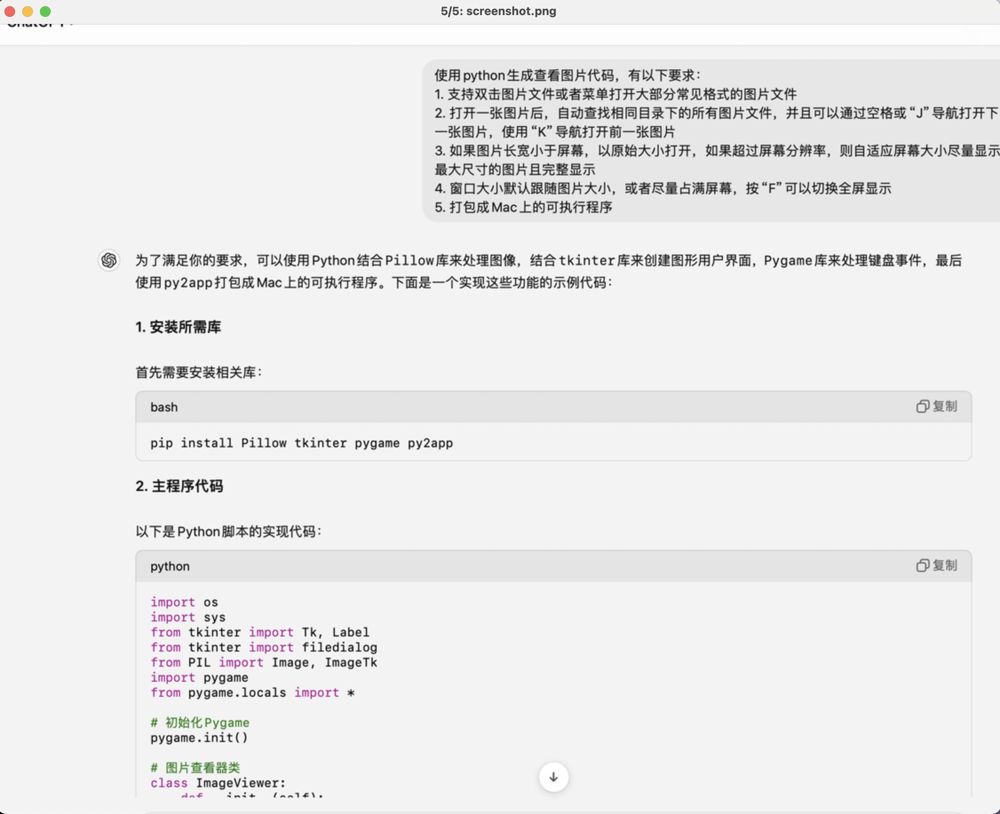

# Pic-Viewer

Pic-Viewer 是一个开源的图像查看器，旨在提供简单高效的使用体验。它允许用户在干净、简洁的界面中轻松查看图像。Pic-Viewer 专注于性能和易用性，是任何寻求轻量级图像查看解决方案的用户的理想选择。


## 特别说明

本代码100%来自AI（ChatGPT）的协助生成，另有文档说明整个过程：[AI助我写代码（2）：图片浏览器
](https://www.broyustudio.com/2024/08/29/AI-Help-Pic-Viwer.html)

## 功能特点

- **轻量级**：Pic-Viewer 设计简洁高效，确保快速加载图像和无缝的用户体验。
- **简洁界面**：用户界面直观易用，可快速上手。
- **跨平台**：Pic-Viewer 兼容多种操作系统，包括 Windows、macOS 和 Linux。
- **快捷键支持**：使用便捷的快捷键轻松浏览图像并执行操作。

## 优势

- **高效性**：Pic-Viewer 使用极少的系统资源，非常适合在较旧或性能较弱的设备上使用。
- **开源**：作为开源项目，Pic-Viewer 免费供用户使用、修改和分发，欢迎并鼓励社区贡献。
- **无冗余功能**：与许多图像查看器不同，Pic-Viewer 专注于核心功能，提供快速、无干扰的使用体验。

## 适用场景

Pic-Viewer 非常适合需要快速高效查看图像的用户，尤其是那些不需要额外功能或复杂操作的情况。理想的使用场景包括：

- 在轻量级环境中查看图像。
- 快速浏览大量图像。
- 喜欢简洁界面且不需要冗余功能的用户。

## 安装指南

按照以下步骤安装 Pic-Viewer：

1. **克隆仓库**：
    ```bash
    git clone https://github.com/winglight/Pic-Viewer.git
    ```

2. **进入项目目录**：
    ```bash
    cd Pic-Viewer
    ```

3. **安装依赖**：
    ```bash
    pip install -r requirements.txt
    ```

4. **运行应用程序**：
    ```bash
    python PicViewer.py # TK版本
    python PicViewer-Qt.py # QT版本
    ```

Pic-Viewer 将启动，然后自动打开文件选择弹窗。也可以通过设置默认打开程序双击图片打开。

## 使用指南

Pic-Viewer 启动后，您可以：

- **打开图像**：使用文件选择器选择图像。
- **浏览图像**：使用空格键、`j`、`k`键在当前目录中的图像之间移动。
- **缩放**：使用 鼠标或触摸板的滚动键放大或缩小图像。
- **全屏**：按 `F` 键切换全屏模式。
- **关闭**：按 `Esc` 键退出当前图像视图或关闭应用程序。

## 贡献

欢迎贡献！如果您想为 Pic-Viewer 做出贡献，请 fork 此仓库并提交您的更改的 pull request。

## 许可证

Pic-Viewer 使用 MIT 许可证。有关更多信息，请参阅 [LICENSE](LICENSE) 文件。